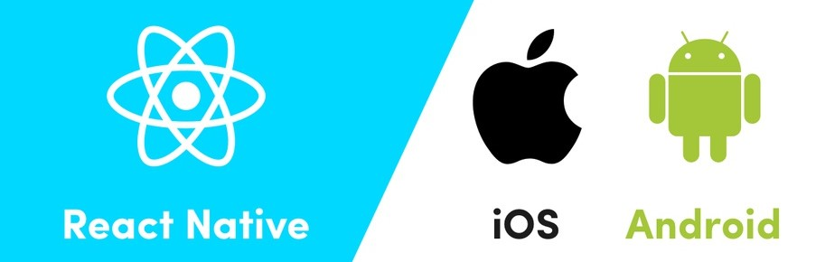
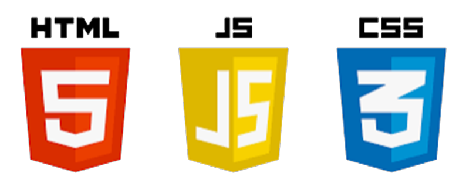
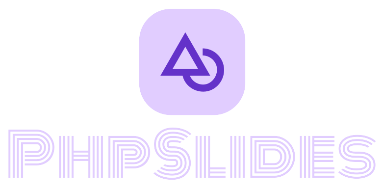
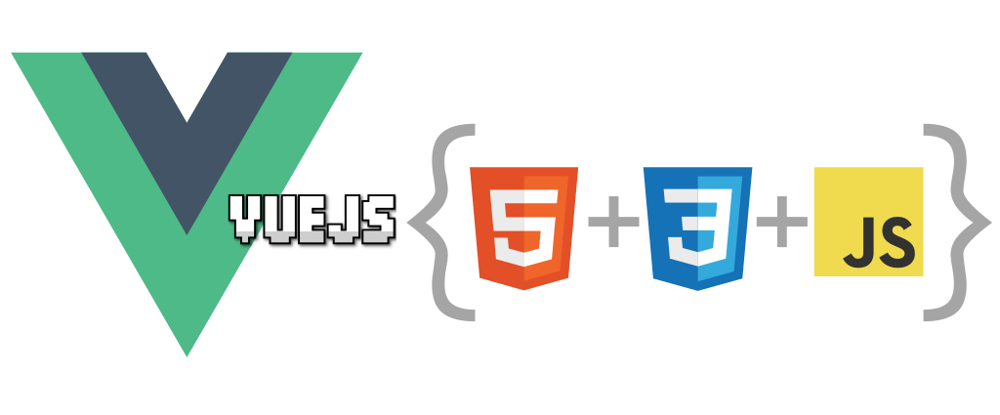
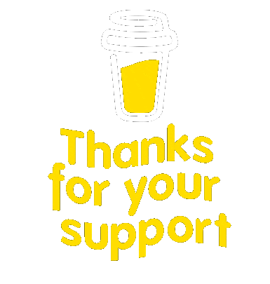

---
# <h1 align="center">Hello 👋, Am Dave Conco</h1>
---

 

Yup... I focus on building something:
- Interesting,
- Useful and 
- Of fun 💕

👫 Work with Teams.

💻 Software Developer.

🎯 I’m currently working on PHP & React Based Projects.

🌱 I’m currently learning more.

👯 I’m looking to collaborate on some web and mobile projects.

💡 I like building frameworks/libraries that would be of helps to other developers and I myself 💯

⭐ Want to connect with me? 

Connect/Chat me up on my LinkedIn [Dave LinkedIn](https://linkedin.com/in/daveconco/)

♎ Can chat me up on WhatsApp 👉 [WhatsApp](https://wa.me/+2348025983267)

  

## 
Time Coded:

### 
Follow me up on:

  
  
  
  
	 
	 
  
  
  
  

 
 

# <h1 align="center">My GitHub Stats</h1>

  
    

&nbsp;&nbsp;

 

  
    
  

 
 

# <h1 align="center">My Tech Skills 🌟</h1>

  

  
   
  
  &nbsp;&nbsp;&nbsp;&nbsp;&nbsp;
  
  
  
    
  
  &nbsp;&nbsp;&nbsp;
  
  

 

  
  

 

  

 
 

# <h1 align="center">Support Me 💫</h1>

   
  
  

     
  

