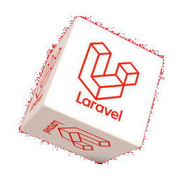

---
# <h1 align="center" style="color:blue"><a href="https://dconco.github.io">dconco.dev</a></h1>
---

I'm dconco, short for Dave Conco, a creative fusion of coding expertise with diverse talents. A dedicated software developer with extensive experience. 💫

I have a passion for community services, creating innovative frameworks and libraries, and contributing to public repositories. 🌟

Notably, I developed and maintain the __[PhpSlides framework](https://github.com/phpslides)__. My focus areas include:

- Building full-stack websites.

- Designing and implementing APIs (Application Programming Interfaces) using PHP, NodeJS and C++.

- Developing mobile applications for both Android and iOS using React Native & Ionic.js 💻

## 
💻 Time Coded:

## 
🌐 Socials:

  
  
  
  
	 
	 
  
  
  
  

 
 

## 
📊 GitHub Stats:

  
    
  

  
	  
	

 

### 
🏆 GitHub Trophies

  

 

## 
💻 Tech Stack:

  

  
   
  
  &nbsp;&nbsp;&nbsp;&nbsp;&nbsp;
  
  
  
    
  
  &nbsp;&nbsp;&nbsp;
  
  

 

  
  

 

  

 
 

## 
✍️ Random Dev Quote

## 
Support Me 💫

   
  
  

     
  

